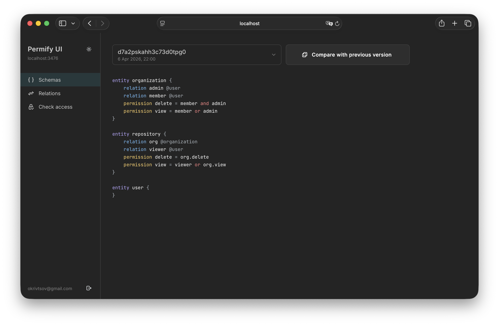
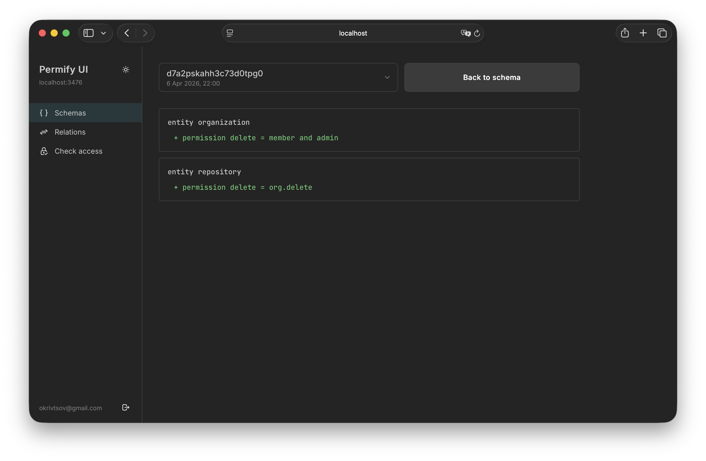
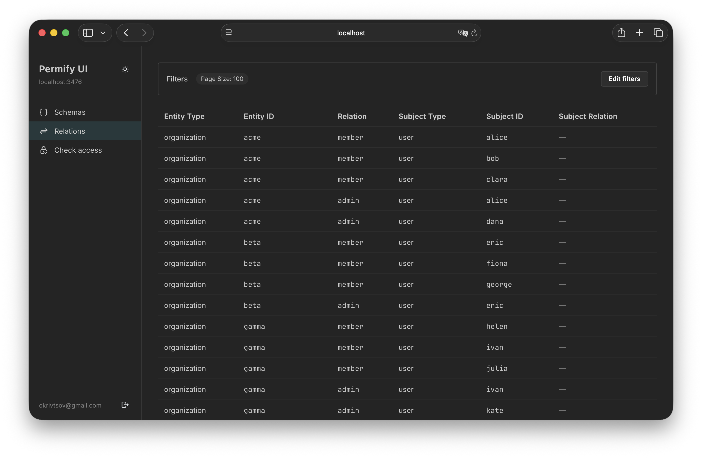
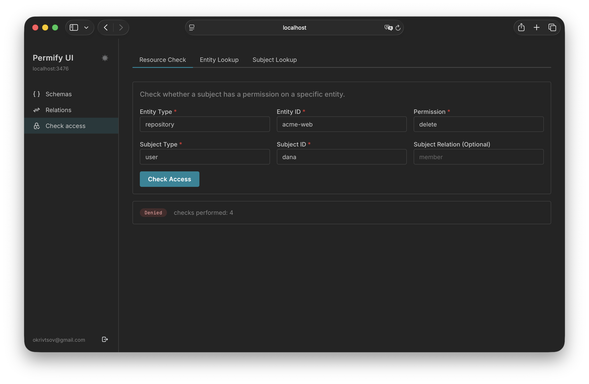

# prmfy-ui

`prmfy-ui` is a lightweight web UI for Permify.

It helps you inspect schema versions, explore relationships, and run access checks without exposing the Permify token directly to the browser.

> Beta release: this project is still early, and compatibility with different Permify versions has not been thoroughly tested yet.

It combines:

- a Go server for auth, proxying, and serving static assets
- a Vite + React frontend for browsing schemas and testing access rules

## UI Features

- Browse schema versions
- Compare a schema with the previous version
- Explore relationships with filters
- Run permission checks
- Run entity lookup and subject lookup

## Access Control

- Optional OIDC login
- Restrict access with an allowlist of user emails

## Why

Permify is API-first. That is great for integrations, but it is not ideal when you want to inspect schemas, look through relationships, or quickly test access rules by hand.

Without a UI, that workflow usually turns into raw API calls, curl commands, or Postman requests.

`prmfy-ui` provides a lightweight interface on top of Permify while keeping sensitive configuration on the server side.

## Architecture

- `main.go` runs the HTTP server, handles auth, proxies approved Permify API calls, and serves the built frontend
- `frontend/` contains the Vite + React + Mantine app
- `dist/` contains the production frontend bundle generated from `frontend/`
- `config.example.yaml` shows the expected config shape
- `config.yaml` is the local untracked config file used to run the app

## Requirements

- Go 1.26+
- Node.js 20+ and npm
- A reachable Permify instance

## Screenshots

<p align="center">
  
  
</p>
<p align="center">
  
  
</p>

Shown above:

- Schema browser
- Schema diff view
- Relationship explorer
- Access check

## Quick Start

1. Create a local config:

```bash
cp config.example.yaml config.yaml
```

2. Update `config.yaml` with your Permify settings.

3. Install frontend dependencies:

```bash
cd frontend
npm install
```

4. Build the frontend:

```bash
cd frontend
npm run build
```

5. Start the server from the repository root:

```bash
go run .
```

6. Open [http://localhost:8080](http://localhost:8080)

## Configuration

The application reads settings from `config.yaml`. Start from `config.example.yaml` and adjust it for your environment.

Main options:

- `permify_url`: URL of your Permify instance
- `permify_token`: optional bearer token used by the server when talking to Permify
- `permify_tenant`: tenant used by the UI
- `api_access.allowed_endpoints`: required list of Permify API calls the UI is allowed to proxy
- `auth.enabled`: enable or disable OIDC login
- `auth.oidc.*`: OIDC provider settings
- `auth.allowed_users`: optional allowlist of user emails

`api_access.allowed_endpoints` contains items like this:

```yaml
api_access:
  allowed_endpoints:
    - method: POST
      path: /v1/tenants/{tenant}/schemas/list
```

`{tenant}` is replaced with the value of `permify_tenant`.

## Development

Common commands:

```bash
cd frontend && npm install
cd frontend && npm run build
cd frontend && npm run typecheck
go build ./...
go run .
```

## Security Model

- The browser talks only to this app, not directly to Permify
- The server proxies only API endpoints listed in `api_access.allowed_endpoints`
- Browser cookies and client-side auth headers are not forwarded to Permify
- Session cookies are protected on non-local hosts and have explicit lifetimes
- When OIDC is enabled, access can be limited to verified emails from an allowlist
- `config.yaml` may contain secrets and must stay out of version control

## License

This project is distributed under the `prmfy-ui Non-Commercial License 1.0`.

- Personal use is allowed
- Internal company use is allowed
- Modification is allowed
- Commercial resale and paid hosted use are not allowed without prior written permission

Commercial licensing requests: `okrivtsov@gmail.com`

This is a source-available license, not a standard open source license.

## Notes

- This repository does not use Next.js
- Frontend source lives in `frontend/src`
- Production frontend assets are generated into `dist/`
